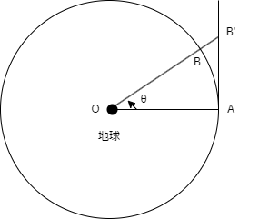

# 第1章 ニュートン力学の誕生
ニュートンによる運動の法則と万有引力の発見は近代科学の幕開けとなりました。
ここでは、その発見に至るまでの経緯をかいつまんで見ていきます。  
人類は長らく、大地は不動であり太陽や惑星、恒星が天空を動くと考えていましたが、16世紀になるとコペルニクス (N. Copernicus, 1473-1543) が地動説を唱えます。
しかし、この時はまだ惑星の軌道を円と考えていたため、地動説の予測する惑星の運動と観測事実の間には乖離がありました。  
その後、ティコ・ブラーエ (Tycho Brahe, 1546-1601) は地動説を確かめるべく、惑星の動きを長期間精密に観測しました。
そして、その助手であったケプラー (J. Kepler, 15721-1630) は、この観測データをもとに、1609年に惑星の運動において3つの法則が成り立つことを発見しました。

1. **楕円軌道の法則**: 惑星は太陽を少雨店とする楕円状を運動する
2. **面積速度一定の法則**: 太陽と惑星を結ぶ線分が単位時間に掃く面積 (面積速度) は一定である
3. **調和の法則**: 惑星が太陽を周回する周期は、その軌道の長半径の 3/2 乗に比例する

同じころ、ガリレイ (Galileo Galilei, 1564-1642) は物の落下を観測する実験を通して、**慣性の法則** を発見しました。
アリストテレス以来、物体の速度はその物体に働く力に比例し、力が働かなければ運動が止まると考えられていました。
しかし、慣性の法則によれば、物体に力が働かなければ物体は等速直線運動を続けるため、惑星に力が働かなくても惑星が運動し続けることになり、地動説に裏付けを与えました。  
慣性の法則によって力を受けなくても惑星が運動し続けることは分かったものの、運動の向きが変わる (周回運動をする) には進行方向に対して横向きの力が必要となります。
ニュートン (I. Newton, 1642-1727) は、この「横向きの力」が太陽が惑星に及ぼしている力であると考えました。
惑星が太陽の方向に向かう力を受けていると考えると、ケプラーの第2法則を説明できます。
また、その力の大きさが太陽からの距の2乗に反比例すると仮定すると、第3法則も導かれることを示しました。
さらにニュートンは、この力が2つの物体を結ぶ方向に働く距離の2乗に反比例する引力であると考え、**万有引力**と名付けました。
万有引力は天体間だけでなく、あらゆる物体間に働くと考えれば、惑星の運動も物が落下するという現象も、同じ法則に支配されていることになり、非常に画期的な発見となりました。

    

ここで、ニュートンの理論と観測結果に定量的一致が得られた例を見てみましょう。
地上では物体が1秒間に 4.9m 落下するという事実が知られていました。
そのため、地球の半径の約60倍の距離 ($3.8 \times 10^{-8}$ m) にある月は、距離の2乗に反比例する距離、すなわち1秒間に $4.9 / 60^2 m = 0.0013m$ だけ落下してくるはずです。  
ここで、月が等速直線運動をしているとすると、地球の引力がなければ A 点から接線方向に進んだ B' 点に移動するはずです。
しかし、月は地球の周りを27日かけて周回しているので、実際には点 B に移動します。
1秒間に月が移動する角度を $\theta$ とすると、$\theta=\frac{2\pi}{27 \times 24 \times 60 \times 60}=2.7 \times 10^{-6}$ (rad) となります。
$\theta$ が十分に小さいとき、円弧は直線に近似できるので $\overline{AB}  \approx \stackrel{\frown}{AB} = \overline{OA} \cdot \theta$ となります。また、$\angle BAB' = \theta / 2$ であり、$\theta$ が十分小さいとき、$\triangle ABB'$ は頂角の非常に小さな二等辺三角形とみなせるので、$\overline{BB'}  \approx  \overline{AB} \cdot \theta / 2$ となります。以上より、$\overline{BB'}  \approx \overline{OA} \cdot \theta^2 / 2 = 3.8 \times 10^8 \times (2.7 \times 10^{-6})^2 / 2=0.0014m$ で、月は1秒間に約 0.0014m だけ地球に向かって落下している計算になり、ニュートンの理論と観測結果がよく一致します。