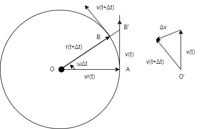

# 第2章 速度、加速度、変化率
質点の位置 (座標)、速度、加速度は、時間に関する微分や積分でお互いに結び付いています。
本章では、物体を点とみなした場合、すなわち質点におけるそれらの関係性について学んでいきます。

## 変位
3次元空間上に固定した座標軸を取り、それぞれの軸に関する質点の座標 $(x, y, z)$ を用いて質点の位置を指定できます。
座標の原点から質点に向かって引いたベクトルを質点の**位置ベクトル** $\mathbf{r}$ と呼び、$\mathbf{r} = (x, y, z)$ と表します。
もし、質点が平面上を運動するのであれば2次元座標 $(x, y)$ を指定すれば、質点の位置は定まりますし、鉛直線上の落下や演習に沿った運動であれば、1次元の座標を指定すれば質点の運動を記述できます。  
位置ベクトルは原点の取り方に依存するので、常にどこを原点に取っているかに注意する必要があります。
一方、質点が位置ベクトル $\mathbf{r}$ の点 P から $\mathbf{r}'$ の点 P' に変位したとき、点 P から点 P' に引いたベクトルは $\mathbf{r}' - \mathbf{r}$ で表され、原点の取り方に依存しません。
このベクトルを**変位ベクトル** と呼びます。

## 速度
1次元の運動を考えたとき、質点の座標 $x$ は時刻 $t$ の関数 $x(t)$ として表現できます。
質点の座標が時間経過とともに、下の図のような変化をする場合を考えてみましょう。

    

時刻 $t$ から $t + \Delta t$ の間に質点が $\Delta x$ だけ変位したとすると、$\Delta x = x(t + \Delta t) - x(t)$ と表せます。
この間の平均速度は $\Delta x / \Delta t$ で表されるます。
ここで、$\Delta t$ を0に近づけた極限をとると、$x(t)$ の $t$ に関する微分となります。

$$
v(t) = \lim_{\Delta t \rightarrow 0} \frac{x(t + \Delta t) - x(t)}{\Delta t} = \frac{dx(t)}{dt}
$$

$v(t)$ は $t$ についての速度であり、しばしば $\dot{x}$ のように座標の上にドットを打って表されます。  
続いて、3次元空間における運動を考えてみましょう。
質点の位置ベクトル $\mathbf{r}$ は $t$ の関数であり、$\mathbf{r} = \mathbf{r}(t) = (x(t), y(t), z(t))$ と表します。
1次元の場合と同様に時刻 $t$ から $t + \Delta t$ の変位を考えると、その変位ベクトル $\Delta \mathbf{r}$ は以下の式で表されます。

$$
\Delta \mathbf{r} = \mathbf{r}(t + \Delta t) - \mathbf{r}(t)
$$

そして、平均速度ベクトル $\Delta \mathbf{r} / \Delta t$ の $\Delta t$ に関するゼロ極限をとると、時刻 $t$ における速度ベクトル $\mathbf{\dot{r}}=\mathbf{v}(t)$ が得られます。

$$
\mathbf{v}(t) = \lim_{\Delta t \rightarrow 0} \frac{\Delta \mathbf{r}}{\Delta t} = \frac{d \mathbf{r}}{dt} = \mathbf{\dot{r}} = (\dot{x}, \dot{y}, \dot{z})
$$

## 変化率
ある量 $x$ が微小量 $\Delta x$ だけ変化したとき、他の量 $y$ が $\Delta y$ 変化したならば、$\Delta y / \Delta x$ を $y$ の $x$ に関する平均変化率と呼びます。
そして、$\Delta x$ をゼロに近づけた極限を $y$ の $x$ に関する変化率と呼び、特に $x$ が時間の時は単に変化率と呼びます。

$$
\lim_{\Delta x \rightarrow 0} \frac{\Delta y}{\Delta x} = \frac{dy}{dx}
$$

今、関数 $y=f(x)$ を考えます。
下の図において $\Delta y = \overline{CB}$ であるが、$\Delta x$ が十分小さければ点 A における接線で $\overline{C'B}$ に近似できる。

    

すなわち、$\Delta y$ は $\Delta x$ に接線の傾き $f'(x)$ を掛けた以下の近似式で表されます。

$$
\Delta y \approx f'(x) + \Delta x
$$

さらに、$\Delta x$ をゼロに近づけた極限を取ると、次の式が成り立ちます。

$$
dy = f'(x)dx
$$

ここで、$dx$ と $dy$ はそれぞれ $x$ と $y$ の**微分** (無限小の変化)と呼びます。

## 加速度
質点の変位の変化率が速度であるように、速度の変化率を加速度 $a$ と呼びます。
ここで、$\ddot{x}(t)$ は2回微分を表します。

$$
a(t) = \dot{v}(t) = \ddot{x}(t)
$$

これは3次元の運動でも成り立ち、速度ベクトルを固定したある1点から引いた時に、その先端の描く軌跡の「速度ベクトル」が、元の質点の加速度ベクトルとなる。

$$
\mathbf{a}(t) = \dot{\mathbf{v}}(t) = \ddot{\mathbf{x}}(t)
$$

ここでは、質点が半径 $r$ の円周上を角速度 $\omega$ で等速円運動をする場合の加速度ベクトルを考えてみましょう。

    

この時、質点の速度は $v = r \omega$ で、円の接線方向を向きます。
また、速度ベクトルをある点 $O'$ から引くと、その先端は同じように角速度 $\omega$ で半径 $v$ の円運動を行います。
よって、速度ベクトルの先端の速度は $v\omega$ であり、元の質点の加速度 (の大きさ) は以下の式で表されます。

$$
a = v \omega = r \omega ^2
$$

この加速度ベクトルは、上の図より $- \mathbf{r}$ の方向を向いています。
一方、第1章で述べた通り、$\omega \Delta t$ が十分に小さければ、以下の式が成り立ちます。

$$
\overline{BB'}= \frac{1}{2} r \omega ^2 (\Delta t)^2
$$

これを、$v=at$ で速度が時間に比例して増加する場合の質点の軌跡が $x = \frac{1}{2}at^2$ であることと見比べると、加速度 $a$ が $r \omega ^2$ となることがわかります。

## 速度の積分
速度 $v$ が時間の関数 $v = v(t)$ である時、ある時刻 $t$ における質点の位置 $x(t)$ の計算方法を考えます。
下の図のように、時刻 $t_0$ から $t$ の間に $N - 1$ 個の点 $t_i$ ($i = 1, 2, \cdots, N-1$) を取り、$t_N = t$ とします。

    

$N$ 個の時間間隔 $\Delta t_i = t_{i+1} - t_i$ ($i = 1, 2, \cdots, N-1$) が十分小さければ、時刻 $t_0$ から $t_1$ の間に速度は $v(t_0)$ で一定であるとみなせるので、その間に質点の進む距離 $\Delta x_0$ は以下の式で与えられます。

$$
\Delta x_0 \approx v(t_0) \Delta t_0
$$

同様の式が $\Delta x_1$　から $\Delta x_{N-1}$ まで成り立つので、これらを全て足し合わせると以下の式が得られます。
ただし、$x_0$ は質点の初期位置です

$$
x(t) - x_0 = \sum_i \Delta x_i \approx \sum_i v(t_i) \Delta t_i
$$

ここで、$N$ を無限大に飛ばし、時間間隔をゼロに近づけていくと、常識の右辺は曲線の下の面積に近づき、速度 $v(t)$ の $t$ に関する積分となります。

$$
x(t) - x_0 = \int_{x_0}^{x(t)}dx = \int_{t_0}^t v(t)dt
$$

変化率の節で見た通り、$dx/dt=v$ なので $dx=vdt$ と書くことができます。
上の積分式は、この両辺を特定の時刻、位置に関して積分した式と一致します。  
最後に、3次元空間の運動の場合を見てみましょう。
速度ベクトルを $\mathbf{v}(t)$、$t=t_0$ の時の位置ベクトルを $\mathbf{r}_0$ とすると、位置ベクトル $\mathbf{r}(t)$ は以下の式で与えられます。

$$
\mathbf{r}(t) - \mathbf{r}_0 = \int_{t_0}^t \mathbf{v}(t) dt
$$